# Deploy Application with Nginx on Virtual Machine using Vagrant

1. Open VirtualBox and Git Bash terminal and set folder destination for Virtual Machine (VM) using the change directory command `cd` in the terminal to the appropriate directory containing your 'Vagrantfile' and 'provision.sh' files (see [automation_nginx_deployment.md](https://github.com/EstherSlabbert/tech230_vagrant_intro/blob/main/automation_nginx_deployment.md) and [nginx_deployment.md](https://github.com/EstherSlabbert/tech230_vagrant_intro/blob/main/nginx_deployment.md) to get these files if you do not already have them) and the extracted 'app' and 'environment' folders provided by the developers.
2. Open and add a line in 'Vagrantfile' `config.vm.synced_folder "app", "/home/vagrant/app"` to put/sync 'app' folder from local machine to VM. Save. 'Vagrantfile' should have same code/similar to code block below:
```ruby
Vagrant.configure("2") do |config|

  config.vm.box = "ubuntu/xenial64"
  config.vm.network "private_network", ip:"192.168.10.100"
  config.vm.provision "shell", path: "provision.sh"
  config.vm.synced_folder "app", "/home/vagrant/app"

end
```
3. `vagrant up` in terminal to create and start running the VM.
4. `vagrant ssh` in terminal to enter the VM. 
5. In your VM environment enter: `sudo apt-get install python-software-properties -y` in order to access the correct/needed version of nodejs. Allow it to complete. The following image should be the output:

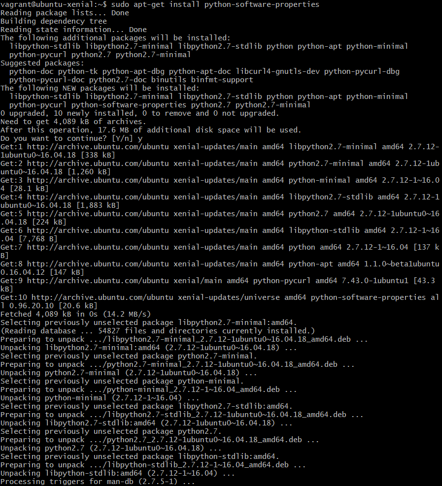

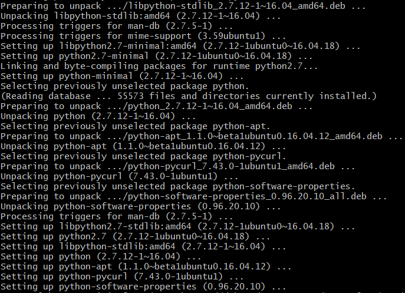

6. Next enter:`curl -sL https://deb.nodesource.com/setup_6.x | sudo -E bash -`, which changes source to look for nodejs to one from specific url internet. It should output the following:

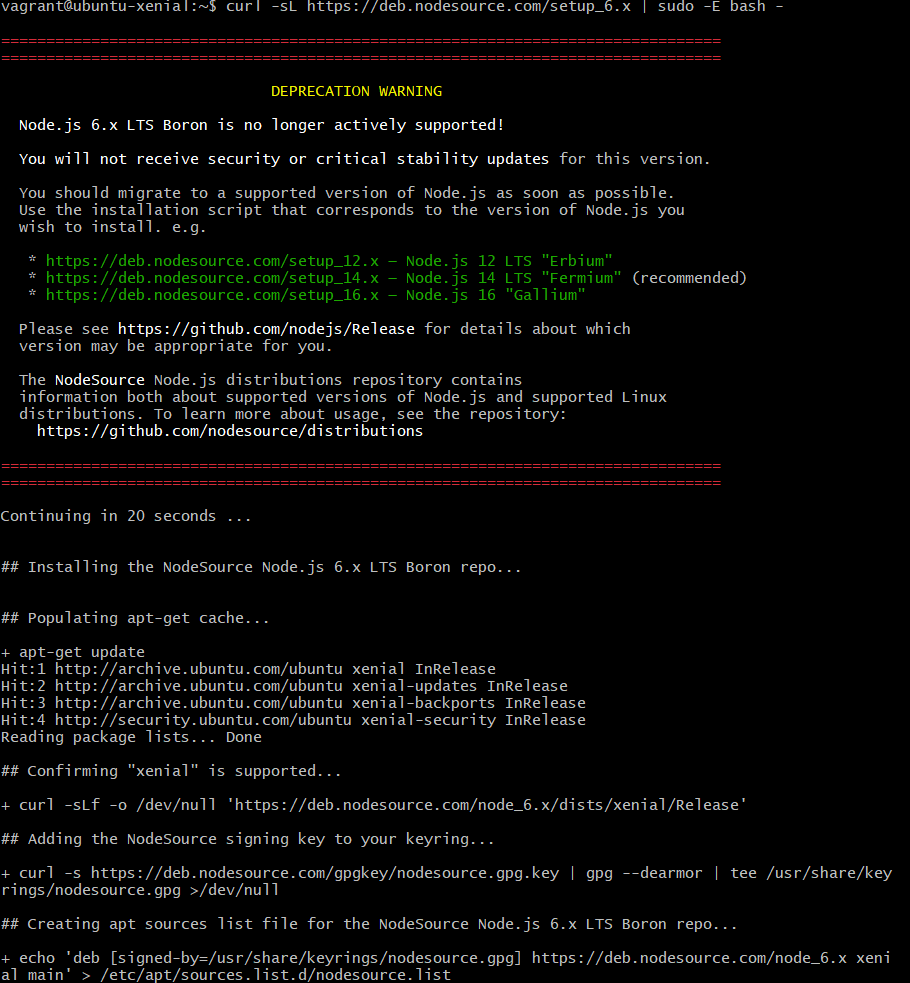

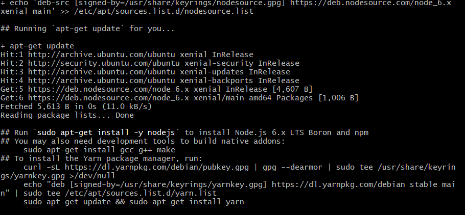

7. Next installs correct version of nodejs by entering: `sudo apt-get install nodejs -y`. Following should be output:

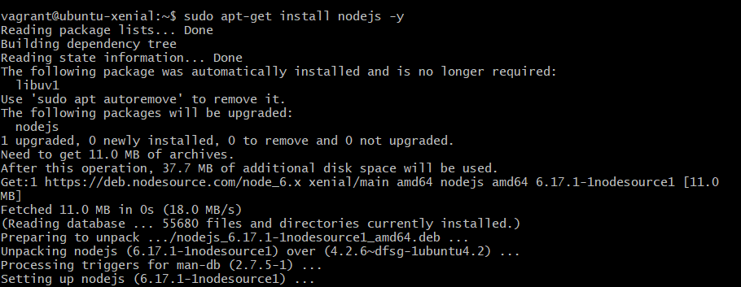

8. Next install pm2 and make it available globally (to all on VM) by entering: `sudo npm install pm2 -g`. (Note: PM2 is a process manager for JavaScript runtime).

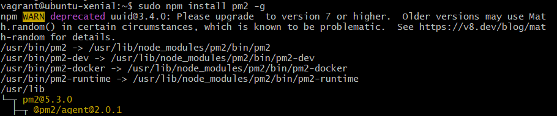

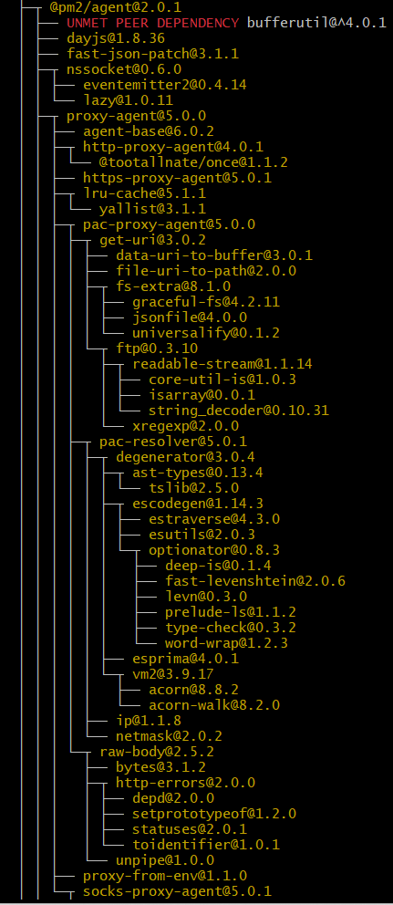

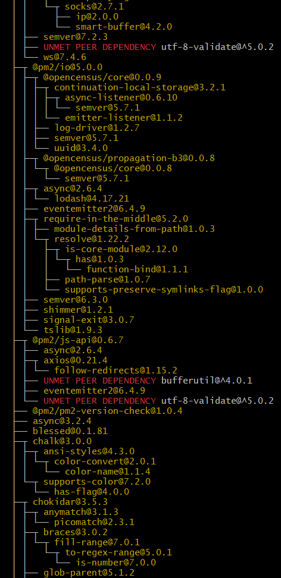

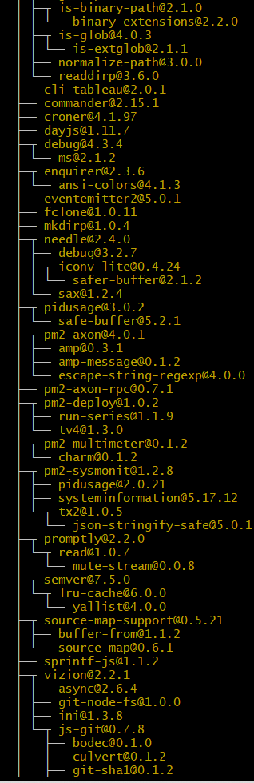

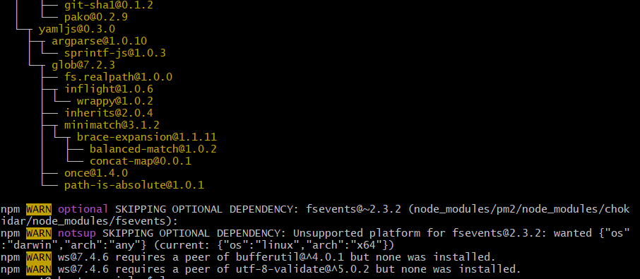

1.  Next install npm by entering: `npm install`. (Note: npm (node package manager) is package manager for JavaScript in this case nodejs)

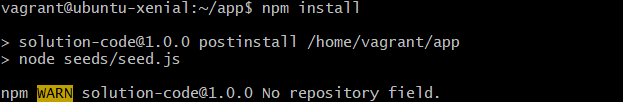

10. Navigate into the 'app' directory in your VM by using the `cd` command.

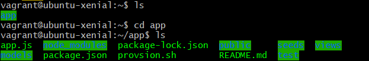

11. Now we can run our app by either entering: `npm start` or `node app.js`. This should return "Your app is ready and listening on port 3000" as a foreground process as shown in the image below:

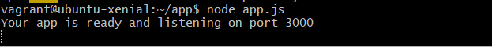

12. Now we can go to our web browser and enter '192.168.10.100:3000' into our url bar to show nodejs app that we ran. It should show the following:

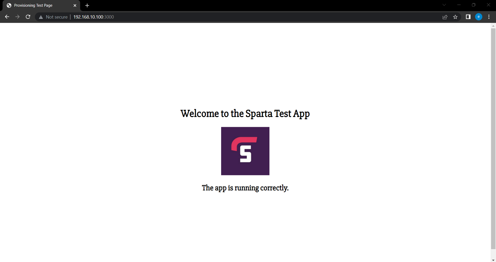