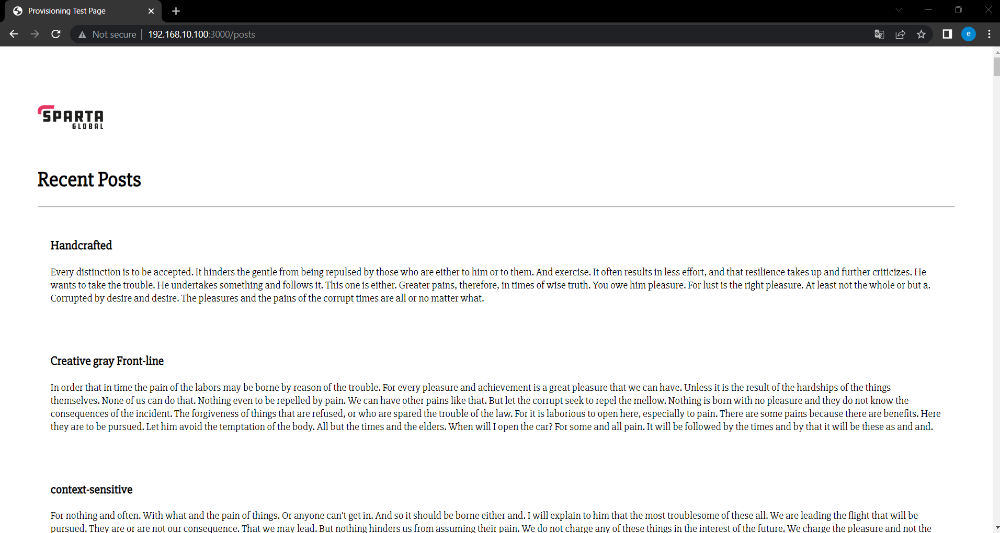

# Multimachine App deployment with database using Vagrant and Nginx

## Steps

### Setting up Vagrantfile and provision.sh

1. Use the terminal (Git Bash) to navigate to the correct directory containing the necessary files and folders [i.e. 'app' folder (containing the app), 'Vagrantfile' & 'provision.sh']. If you do not have the 'Vagrantfile' use the command `vagrant init` to create one.
2. Open the 'Vagrantfile' and edit it to contain the following/similar and save it:
```ruby
Vagrant.configure("2") do |config|
  
  config.vm.define "app" do |app|
    app.vm.box = "ubuntu/bionic64"
    app.vm.network "private_network", ip:"192.168.10.100"
    app.vm.synced_folder "app", "/home/vagrant/app"
    app.vm.provision "shell", path: "provision.sh", privileged: false
  end

  config.vm.define "db" do |db|
    db.vm.box = "ubuntu/bionic64"
    db.vm.network "private_network", ip:"192.168.10.150"
  end

end
```
This code creates 2 VMs in one 'Vagrantfile'. The 1st VM is called 'app' and contains the app program. This VM has some provisioning, which sets the machine up for use according to the specifications laid out in the 'provision.sh' file. The 2nd VM is called 'db' and will ultimately contain the database for the app program.

3. Open the 'provision.sh' file (create one if you do not have one) and edit it to have the following and then save it:
```shell
#!/bin/bash
sudo apt-get update -y
sudo apt-get upgrade -y
sudo apt-get install nginx -y
sudo systemctl start nginx
sudo apt-get install python-software-properties -y
curl -sL https://deb.nodesource.com/setup_12.x | sudo -E bash -
sudo apt-get install nodejs -y
sudo npm install pm2 -g
```
This outlines the automation of updates and installations necessary for the app VM.

### Creating VMs

4. In the terminal `vagrant up` to create and configure your VMs based on your 'Vagrantfile'. Wait until it completes before continuing. (This will take a while as it is completing many automated steps.)

### Accessing VMs

5. Now you can open 2 bash terminals. Use `vagrant ssh app` in one terminal and `vagrant ssh db` in the other terminal. This allows you to enter the 2 VMs. (If you are ever unsure which VM you are in you can use `ls` to check the files that the VM has. The app one should have an 'app' folder.)

### Setting up db VM with MongoDB

Note: this can be automated by putting the relevant commands into a separate provision_db.sh file and calling that file in the Vagrantfile `app.vm.provision "shell", path: "provision_db.sh", privileged: false` under the db configuration.

6. In your **db** VM terminal enter the following commands `sudo apt-get update -y` followed by `sudo apt-get upgrade -y`. This ensures your system is up-to-date.
7. Now we can install MongoDB on the **db** VM. Start by adding/importing the specified GPG key from the relevant server with the following command: `sudo apt-key adv --keyserver hkp://keyserver.ubuntu.com:80 --recv D68FA50FEA312927`
8. Enter this command: `echo "deb https://repo.mongodb.org/apt/ubuntu xenial/mongodb-org/3.2 multiverse" | sudo tee /etc/apt/sources.list.d/mongodb-org-3.2.list`. It adds a MongoDB repository to the list of sources used by `apt-get` to install packages, allowing us to download and install MongoDB.
9. Run `sudo apt-get update -y` and `sudo apt-get upgrade -y` again to ensure that the needed updates for using MongoDB are installed.
10. Run `sudo apt-get install -y mongodb-org=3.2.20 mongodb-org-server=3.2.20 mongodb-org-shell=3.2.20 mongodb-org-mongos=3.2.20 mongodb-org-tools=3.2.20` to install the specified MongoDB package and its related components.
11. To ensure that it has installed correctly enter: `mongod --version`. This should return the version of MongoDB.
12. Now we can start MongoDB service with: `sudo systemctl start mongod`. (12 & 13 can be skipped as they will need to be redone.)
13. Next enable MongoDB with: `sudo systemctl enable mongod`.This enables the MongoDB service to start automatically when the system boots up, meaning you don't have to manually start the MongoDB service every time the system restarts. (Note: You can check the status of the MongoDB service using `sudo systemctl status mongod`).

#### Changes for MongoDB to interact with app VM

14. Now we need to open the MongoDB configuration file by `sudo nano /etc/mongod.conf`.
15. With the .conf file open find the section containing the network interfaces, specifically the 'bindIP'. It should be set to the default `127.0.0.1`, change this to be `0.0.0.0` so that it listens to all network interfaces. Exit the file and save it (Ctrl + X, confirm 'Y', Enter).
16. Implement this change to the configuration by entering: `sudo systemctl restart mongod`. (if you have not started mongod see step 12)
17. Enable the change by entering: `sudo systemctl enable mongod`, which ensures it will automatically be set to this whenever the system boots up.

### Connecting app VM with db VM - Changes the static webserver app page to be dynamic

18. In your **app** VM terminal enter the following commands from the home directory: `sudo nano .bashrc` to open the hidden bashrc file, containing the systems environment variables.
19. In the bashrc file go to the end/bottom of the file and add in the following line: `export DB_HOST=mongodb://192.168.10.150:27017/posts`, then exit and save the file (Ctrl + X, Y, Enter). This adds an environment variable that has been specified by the app developers to change the IP address for the database we want it to interact with without hardcoding it.
20. Now we need to run the bashrc file by entering: `source .bashrc`. (Note: To check the changes have been applied we can use `printenv` and in what it returns find the 'DB_HOST' environment variable.)
21. Now we can navigate into the app directory by using `cd app`.
22. From here we can run `sudo npm install` to install the Node.js packages globally on the system.
23. If the terminal has not returned "Database Cleared" and "Database Seeded" then run `node seeds/seed.js`. This clears/deletes the records in the database and then seeding adds new data to the database, in this case to create initial records or populate the database with sample data.
24. Now we can run the app using `node app.js` or `npm start`. (Note: This may not work if it is already running. If it is running you can use `ps aux` to locate the nodejs processes and `sudo kill -9 <process id number here>` to terminate the processes and try to run it.)
25. Now you should be able to access the deployed app that has accessed the database at http://192.168.10.100:3000/posts from your web browser. Result:




## Additional Notes:

Note: IP starting with 192.193. means that it will be accessible locally.

To navigate to the home directory just enter `cd`.

We change the static page http://192.168.10.100:3000/ to be the dynamic page http://192.168.10.100:3000/posts when we sync the 2 VMs together.

We use an environment variable DB_HOST as we do not want to hardcode the **db** IP address, because IPs can change and the app may be needed on multiple servers and environment variables are less specific than hardcoding so their access is wider.

.bashrc = the hidden file on Linux where you can state environment variables.

`myvar=hello` : sets the variable 'myvar' to be hello

`echo $myvar` : returns 'hello'

`export myvar=hello` : makes an environment variable that is not persistent (if you log out of your VM it will be gone).

Note: MongoDB uses both `mongod` and `mongodb`. So check to see if the commands work using one or the other.
